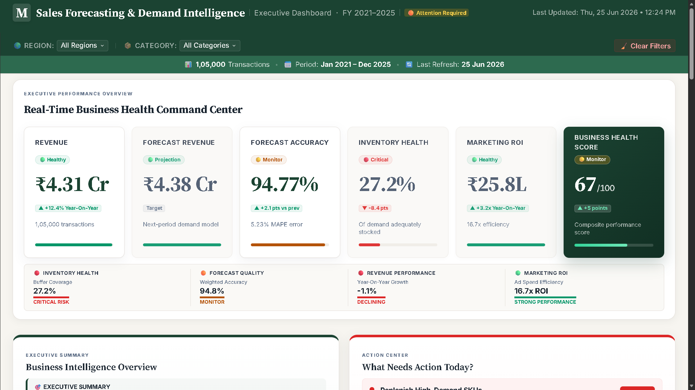
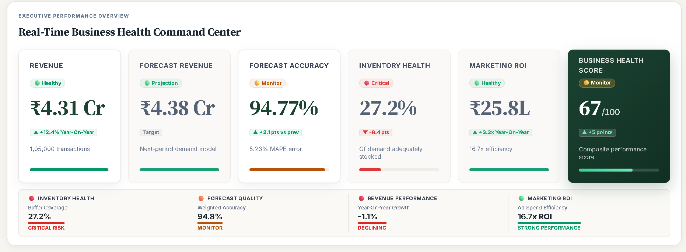
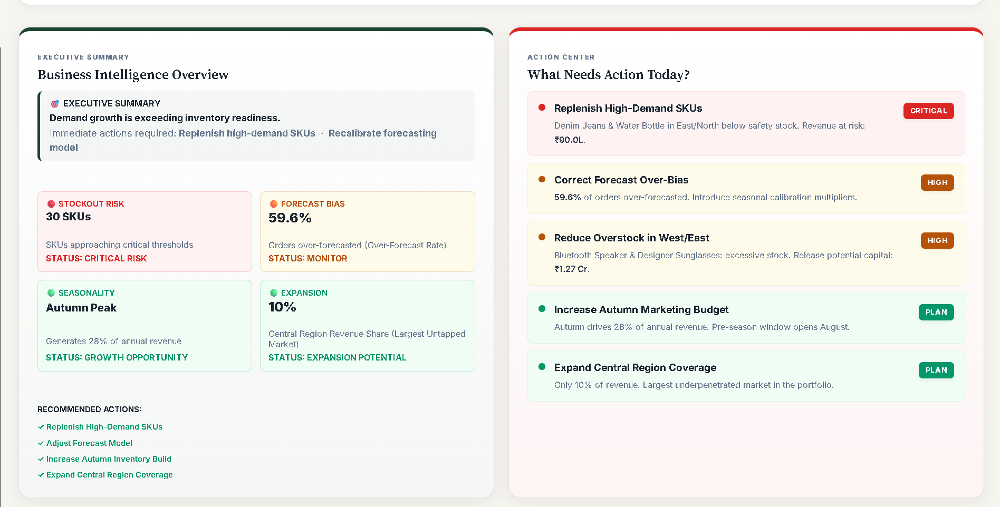
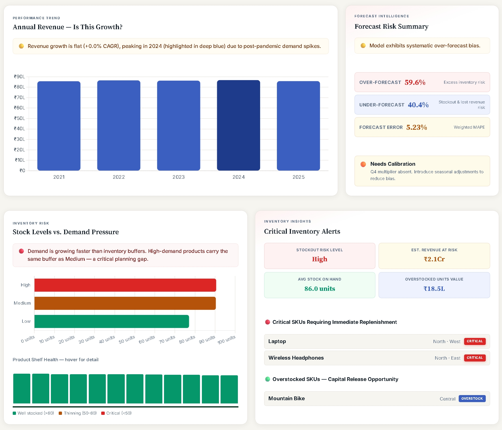
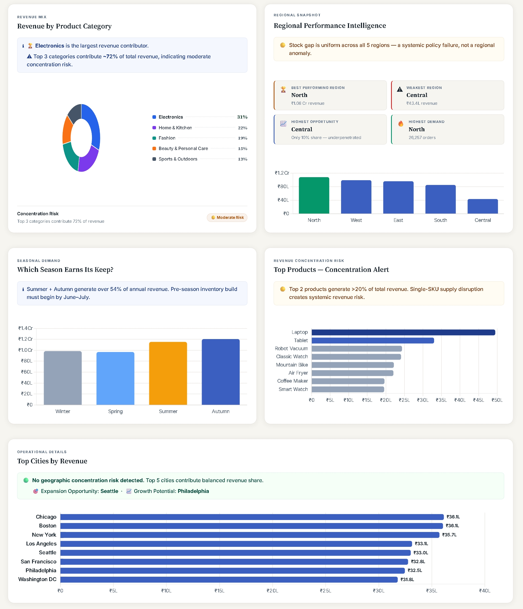

# 📈 Sales Forecasting & Demand Prediction Dashboard

<p align="center">


**An Executive-Grade Business Intelligence Dashboard for Sales Forecasting, Demand Prediction, Inventory Optimization, and Strategic Decision-Making**

Executive-grade Business Intelligence dashboard built with Python, ETL pipelines, Forecast Analytics, and Chart.js to support strategic retail decision-making.

</p>

---

# 🌐 Live Demo

[](https://girishshenoy16.github.io/sales-forecasting-demand-prediction-dashboard/)

---

# 📸 Dashboard Preview

The following screenshots showcase the major executive modules available in the dashboard.

<table>
<tr>
<td align="center">

### Executive Dashboard



</td>

<td align="center">

### KPI Command Center



</td>
</tr>

<tr>
<td align="center">

### Executive Decision Support



</td>

<td align="center">

### Forecast & Inventory Intelligence



</td>
</tr>

<tr>
<td colspan="2" align="center">

### Business Intelligence Summary



</td>
</tr>
</table>

---

# 📑 Table of Contents

| Section                                             | Section                                                         |
|-----------------------------------------------------|-----------------------------------------------------------------|
| 📌 [Project Highlights](#-project-highlights)       | 🚀 [Dashboard Features](#-dashboard-features)                   |
| 📖 [Repository Overview](#-repository-overview)     | 🛠 [Tech Stack](#-tech-stack)                                   |
| 📊 [Project Statistics](#-project-statistics)       | 📂 [Project Structure](#-project-structure)                     |
| 🎯 [Why This Project?](#-why-this-project)          | 🚀 [Running the Project Locally](#-running-the-project-locally) |
| 🎯 [Project Objective](#-project-objective)         | 💡 [Key Insights](#-key-insights)                               |
| 📊 [Dataset Description](#-dataset-description)     | 📈 [Business Impact](#-business-impact)                         |
| ⚙️ [Methodology](#-methodology)                     | 🚀 [Future Enhancements](#-future-enhancements)                 |
| 🏗 [Solution Architecture](#-solution-architecture) | 🏁 [Conclusion](#-conclusion)                                   |
| 📈 [Forecasting Logic](#-forecasting-logic)         | 📜 [License](#-license)                                         |
| 📊 [Analysis Performed](#-analysis-performed)       | 👨‍💻 [Author](#-author)                                        |
|                                                     | ⭐ [Support the Project](#-support-the-project)                  |


---

# 📌 Project Highlights

This project demonstrates how modern Business Intelligence solutions can transform raw retail sales transactions into executive-level insights that support strategic decision-making.

### 🚀 Key Highlights

* 📊 **105,000+** Retail Sales Transactions
* 📅 **Five Years** of Historical Sales Data (2021–2025)
* 📈 Executive Sales Forecasting Dashboard
* 📦 Inventory Health & Stock Risk Monitoring
* 🌍 Regional & City-Level Performance Analysis
* 📉 Forecast Accuracy & Forecast Bias Monitoring
* 💹 Marketing ROI Analysis
* 🛍 Revenue Mix by Product Category
* 🌤 Seasonal Demand Intelligence
* 🎯 Interactive Region & Category Filters
* 📁 Single Source of Truth using `data/dashboard_data.json`
* 🌐 Deployed on GitHub Pages
* 💼 Production-Ready Project Structure
* 📱 Responsive Executive Dashboard
* 📋 Business Health Score
* ⚡ Dynamic Executive Recommendations
* 📊 Interactive Charts powered by Chart.js
* 🐍 Python ETL Pipeline
* 📈 Executive Decision Support System (EDSS)

---

# 📖 Repository Overview

This repository demonstrates the complete lifecycle of a Business Intelligence solution, 
from synthetic data generation and ETL processing to forecasting, KPI computation, interactive visualization, 
and executive decision support. The project is designed to simulate an enterprise analytics workflow and showcase 
production-style data engineering, business analytics, and dashboard development practices.

---

# 📊 Project Statistics

The dashboard analyzes a large-scale synthetic retail dataset and presents executive-level insights through interactive visualizations and business intelligence modules.

| Metric             |                      Value |
|--------------------|---------------------------:|
| Dataset Size       |           105,000+ Records |
| Historical Period  |                  2021–2025 |
| Product Categories |                          5 |
| Regions            |                          5 |
| Cities             |                        10+ |
| Dashboard KPIs     |                        25+ |
| Interactive Charts |                        10+ |
| Dashboard Modules  |                          8 |
| Data Source        | `data/dashboard_data.json` |
| Deployment         |               GitHub Pages |

---

# 🎯 Why This Project?

Modern retail organizations generate enormous volumes of transactional data every day. While this data contains valuable business information, raw reports alone are often insufficient for executive decision-making.

Business leaders require a centralized platform that transforms operational data into meaningful insights, enabling them to monitor revenue performance, evaluate forecasting reliability, optimize inventory, identify regional growth opportunities, and make strategic business decisions.

The Sales Forecasting & Demand Prediction Dashboard was developed to bridge this gap by combining data engineering, business analytics, forecasting intelligence, and executive reporting into a single interactive solution.

Rather than functioning as a traditional reporting dashboard, the project serves as an **Executive Decision Support System (EDSS)** that helps leadership teams understand business performance and take proactive action.

---

# 🎯 Project Objective

## Business Problem

Retail organizations generate thousands of transactions every day across multiple stores, product categories, and geographic regions. Although this data contains valuable business intelligence, decision-makers often struggle to answer important operational questions quickly.

Some of the most common business challenges include:

* Are sales growing consistently?
* Which products are driving revenue?
* How accurate are demand forecasts?
* Which products are likely to experience stockouts?
* Which regions require additional investment?
* Are marketing campaigns delivering sufficient returns?
* How healthy is the overall business?

Traditional reports often require executives to review multiple spreadsheets before making decisions, leading to slower responses and missed opportunities.

---

## Project Goal

The goal of this project is to build an **Executive Sales Forecasting & Demand Prediction Dashboard** that consolidates historical sales, forecasting metrics, inventory intelligence, and business KPIs into a single interactive platform.

The dashboard enables executives, business analysts, and operations teams to monitor business performance in real time, identify operational risks, evaluate forecasting reliability, and make data-driven strategic decisions.

---

## Business Objectives

The dashboard was designed to support the following business objectives:

### 📈 Revenue Intelligence

* Monitor overall revenue performance
* Analyze long-term sales trends
* Evaluate Year-On-Year growth
* Identify revenue concentration

---

### 📦 Inventory Optimization

* Detect stockout risks
* Identify excess inventory
* Improve replenishment planning
* Reduce warehouse carrying costs

---

### 📉 Forecast Intelligence

* Measure forecast accuracy
* Identify forecast bias
* Compare forecasted vs actual sales
* Improve planning reliability

---

### 🌍 Regional Performance

* Compare regional sales
* Evaluate city-level contribution
* Identify growth opportunities
* Support geographic expansion planning

---

### 💼 Executive Decision Support

* Monitor executive KPIs
* Generate strategic recommendations
* Highlight business risks
* Support quarterly business reviews

---

# 📊 Dataset Description

## Dataset Overview

The project utilizes a **synthetically generated retail sales dataset** containing approximately **105,000 transaction records** covering the period from **2021 to 2025**.

The dataset was specifically designed to simulate a realistic enterprise retail environment by incorporating historical sales, inventory levels, forecasting information, marketing expenditure, product hierarchy, and regional performance.

The data closely resembles the type of information typically available in retail ERP and Business Intelligence systems.

---

## Dataset Statistics

| Attribute           |     Value |
| ------------------- | --------: |
| Total Records       |  105,000+ |
| Time Period         | 2021–2025 |
| Historical Years    |         5 |
| Regions             |         5 |
| Major Cities        |       10+ |
| Product Categories  |         5 |
| Individual Products |       20+ |
| Dashboard KPIs      |       25+ |
| Interactive Charts  |       10+ |

---

## Dataset Features

The dataset includes comprehensive business information such as:

### Sales Information

* Order ID
* Order Date
* Units Sold
* Unit Price
* Sales Revenue

---

### Product Information

* Product Category
* Product Name
* Discount Percentage

---

### Geographic Information

* Region
* City

---

### Inventory Information

* Stock Available
* Demand Level

---

### Marketing Information

* Marketing Spend
* Marketing ROI

---

### Forecast Information

* Forecasted Sales
* Actual Sales
* Forecast Error
* Forecast Accuracy

---

### Time-Based Features

* Month
* Quarter
* Year
* Season

---

## Business Value of the Dataset

This dataset enables multiple types of business analysis, including:

* Sales Performance Analysis
* Demand Forecasting
* Inventory Optimization
* Revenue Intelligence
* Regional Performance Evaluation
* Seasonal Demand Analysis
* Product Category Analysis
* Marketing Effectiveness Analysis
* Executive KPI Monitoring

By combining operational and financial metrics into a unified dataset, the dashboard provides a complete view of business performance and supports data-driven decision-making.

---

# ⚙️ Methodology

The project follows a structured analytics pipeline that transforms synthetic retail transactions into an interactive 
executive dashboard. Each stage is designed to ensure data quality, business relevance, and dashboard performance.

---

# 🏗 Solution Architecture

```text
Python Data Generation
        │
        ▼
Synthetic Retail Dataset
        │
        ▼
Data Cleaning & Validation
        │
        ▼
Feature Engineering
        │
        ▼
Business Rules & KPI Calculation
        │
        ▼
Dashboard Data Generation
        │
        ▼
data/dashboard_data.json
(Single Source of Truth)
        │
        ▼
JavaScript Dashboard Engine
        │
        ▼
Executive Decision Support Dashboard
```

---

## Pipeline Stages

| Stage                             | Description                                                                                                                               | Output                   |
|-----------------------------------|-------------------------------------------------------------------------------------------------------------------------------------------|--------------------------|
| **1. Synthetic Data Generation**  | Generates realistic retail sales transactions covering products, regions, inventory, marketing, and forecasting metrics.                  | Raw Retail Dataset       |
| **2. Data Cleaning & Validation** | Cleans the dataset by handling missing values, removing duplicates, validating business rules, and standardizing formats.                 | Cleaned Dataset          |
| **3. Feature Engineering**        | Creates business KPIs including Revenue, Forecast Accuracy, Inventory Health, Marketing ROI, Business Health Score, and seasonal metrics. | Business Features & KPIs |
| **4. Business Rule Engine**       | Applies business logic to detect inventory risks, forecast bias, revenue trends, and regional growth opportunities.                       | Executive Insights       |
| **5. Dashboard Data Aggregation** | Aggregates KPIs into executive summaries for revenue, forecasting, inventory, products, regions, and seasonal performance.                | Dashboard Metrics        |
| **6. Dashboard Data Export**      | Exports all processed information into `data/dashboard_data.json`, which serves as the dashboard's centralized data source.               | JSON Data Source         |

---

## Dashboard Data Flow

Every KPI card, chart, filter, recommendation, and executive insight displayed in the dashboard is generated dynamically from **`data/dashboard_data.json`**, ensuring a single source of truth and consistent reporting across the entire application.

---

## Methodology Summary

The project follows a production-style analytics workflow consisting of:

* Synthetic Data Generation
* Data Cleaning & Validation
* Feature Engineering
* Business Rule Evaluation
* KPI Aggregation
* Dashboard Data Export

This modular pipeline separates data processing from visualization, making the solution easier to maintain, extend, and deploy while ensuring consistent executive reporting.

---

# 📈 Forecasting Logic

Forecasting is a critical component of the dashboard because it helps businesses prepare for future demand and optimize inventory planning.

The forecasting module compares historical performance with projected sales to evaluate forecasting reliability.

---

## Forecast Metrics

The dashboard calculates:

* Forecast Revenue
* Forecast Accuracy
* Forecast Error
* Forecast Bias
* Over-Forecast Rate
* Under-Forecast Rate

These metrics help determine how well future demand has been predicted.

---

## Forecast Accuracy

Forecast Accuracy measures how closely the predicted sales match the actual sales.

A higher accuracy percentage indicates that the forecasting model is performing well and can be trusted for operational planning.

Business Benefits:

* Better procurement planning
* Improved inventory allocation
* Reduced operational uncertainty

---

## Forecast Error

Forecast Error measures the difference between forecasted sales and actual sales.

Business Purpose:

* Identify planning inaccuracies
* Monitor forecasting performance
* Improve future predictions

---

## Forecast Bias

The dashboard identifies directional forecasting bias.

### Over-Forecasting

Occurs when forecasted sales are consistently higher than actual sales.

Business Impact:

* Excess inventory
* Higher warehouse costs
* Increased working capital
* Slow-moving stock

---

### Under-Forecasting

Occurs when forecasted sales are consistently lower than actual sales.

Business Impact:

* Stock shortages
* Lost revenue
* Customer dissatisfaction
* Emergency procurement

---

## Inventory Forecasting Logic

Forecasting results are combined with inventory levels to identify operational risks.

Examples:

### High Demand + Low Inventory

Recommendation:

Increase inventory immediately to avoid stockouts.

---

### Low Demand + High Inventory

Recommendation:

Reduce procurement and optimize warehouse utilization.

---

### Balanced Demand + Healthy Inventory

Recommendation:

Maintain current inventory strategy.

---

## Business Decision Support

Forecasting intelligence helps executives answer questions such as:

* Can current inventory satisfy future demand?
* Which products require replenishment?
* Is the forecasting model reliable?
* Are we carrying excess inventory?
* Which regions require additional stock?

By combining forecasting with inventory intelligence, the dashboard supports proactive planning rather than reactive decision-making.

---

# 📊 Analysis Performed

The dashboard performs multiple layers of business analysis to provide a comprehensive understanding of organizational performance.

---

## Revenue Analysis

Revenue analysis evaluates overall financial performance.

Includes:

* Annual Revenue Trends
* Year-On-Year Growth
* Revenue Distribution
* Revenue Concentration
* Product Category Contribution

Business Questions Answered:

* Is revenue growing consistently?
* Which categories generate the most revenue?
* Is revenue diversified?

---

## Forecast Analysis

Forecast analysis evaluates planning reliability.

Includes:

* Forecast Accuracy
* Forecast Error
* Forecast Bias
* Forecast Revenue
* Forecast Reliability

Business Questions Answered:

* Can we trust the demand forecast?
* Is the forecasting model overestimating or underestimating demand?

---

## Inventory Analysis

Inventory analysis monitors operational readiness.

Includes:

* Inventory Health
* Stock Availability
* Stockout Risks
* Overstock Identification
* Inventory Pressure

Business Questions Answered:

* Which products need replenishment?
* Which products occupy unnecessary warehouse space?

---

## Regional Analysis

Regional analysis compares business performance across different markets.

Includes:

* Regional Revenue
* City Performance
* Geographic Distribution
* Growth Opportunities

Business Questions Answered:

* Which region performs best?
* Where should future investments be directed?

---

## Product Analysis

Product analysis evaluates revenue contribution across categories.

Includes:

* Revenue by Product Category
* Category Contribution
* Product Rankings

Business Questions Answered:

* Which categories drive business growth?
* Are we overly dependent on a single category?

---

## Seasonal Demand Analysis

Seasonal analysis measures changes in customer demand throughout the year.

Includes:

* Seasonal Revenue
* Seasonal Growth
* Peak Demand Periods
* Procurement Planning

Business Questions Answered:

* Which season generates maximum demand?
* When should inventory be increased?

---

## Marketing Analysis

Marketing analysis evaluates campaign effectiveness.

Includes:

* Marketing Spend
* Marketing ROI
* Revenue per Marketing Dollar

Business Questions Answered:

* Are marketing campaigns profitable?
* Which campaigns deliver the highest return?

---

## Executive KPI Analysis

The dashboard consolidates all major business metrics into executive KPIs.

Monitored KPIs include:

* Revenue
* Forecast Revenue
* Forecast Accuracy
* Inventory Health
* Marketing ROI
* Business Health Score

These KPIs provide executives with a quick overview of organizational performance without requiring detailed analysis.

---

# 🚀 Dashboard Features

The **Sales Forecasting & Demand Prediction Dashboard** is designed as an **Executive Decision Support System (EDSS)**, 
enabling leadership teams to monitor business performance, evaluate forecasting accuracy, optimize inventory, and 
make informed strategic decisions.

Unlike traditional dashboards that only present charts, this dashboard combines **Business Intelligence**, 
**Forecast Analytics**, and **Executive Storytelling** into a unified decision-making platform.

The dashboard is organized into eight executive intelligence modules that collectively provide a complete view of 
organizational performance, forecasting, inventory, regional operations, and strategic decision support.

---

| Module                   | Purpose                |
| ------------------------ | ---------------------- |
| KPI Command Center       | Executive KPIs         |
| Executive Summary        | Business Overview      |
| Forecast Intelligence    | Planning               |
| Inventory Intelligence   | Stock Monitoring       |
| Revenue Intelligence     | Revenue Trends         |
| Regional Intelligence    | Geographic Performance |
| Seasonal Intelligence    | Demand Analysis        |
| Operational Intelligence | City-Level Insights    |

---

## 📊 Executive Performance Command Center

The Executive Performance Command Center serves as the primary dashboard overview, providing leadership with a high-level snapshot of organizational performance.

### Executive KPIs

* 💰 Revenue
* 📈 Forecast Revenue
* 🎯 Forecast Accuracy
* 📦 Inventory Health
* 💹 Marketing ROI
* 🏆 Business Health Score

### Business Value

Executives can understand the overall health of the business within seconds without navigating multiple reports.

---

## 🧠 Business Intelligence Overview

This section summarizes the organization's current business condition using concise executive language.

### Includes

* Executive Summary
* Critical Risks
* Growth Opportunities
* Recommended Actions

### Purpose

Instead of requiring executives to interpret multiple charts, this section provides a clear business narrative and highlights the most important operational priorities.

---

## 📈 Revenue Intelligence

The Revenue Intelligence module focuses on financial performance over time.

### Features

* Annual Revenue Trend
* Revenue Performance Summary
* Year-On-Year Growth
* Revenue Stability Monitoring

### Business Questions Answered

* Is revenue increasing consistently?
* Are financial targets being achieved?
* Is the business maintaining long-term growth?

---

## 📉 Forecast Intelligence

Forecast Intelligence evaluates the quality of demand forecasting.

### Features

* Forecast Revenue
* Forecast Accuracy
* Forecast Error
* Forecast Bias
* Forecast Risk Summary

### Business Questions Answered

* Can current forecasts be trusted?
* Is the business overestimating or underestimating demand?
* Should forecasting models be recalibrated?

---

## 📦 Inventory Intelligence

Inventory Intelligence helps operations teams monitor stock health and identify inventory risks before they affect customers.

### Features

* Inventory Health Score
* Stockout Risk Detection
* Overstock Identification
* Inventory Pressure Analysis
* Critical Inventory Alerts

### Business Questions Answered

* Which products require replenishment?
* Which products are overstocked?
* How healthy is the current inventory?

---

## 🛍 Revenue Mix Intelligence

The Revenue Mix section analyzes how revenue is distributed across different product categories.

### Features

* Revenue by Product Category
* Category Contribution
* Product Concentration Analysis

### Business Questions Answered

* Which category generates the highest revenue?
* Is revenue diversified across categories?
* Which product categories require additional investment?

---

## 🌍 Regional Intelligence

Regional Intelligence evaluates geographic business performance.

### Features

* Regional Revenue Distribution
* Best Performing Region
* Growth Opportunities
* Geographic Contribution
* Regional Rankings

### Business Questions Answered

* Which region contributes the most revenue?
* Which region has the highest growth potential?
* Where should future expansion occur?

---

## 🌤 Seasonal Demand Intelligence

Seasonal analysis helps organizations prepare inventory and marketing strategies based on demand fluctuations throughout the year.

### Features

* Seasonal Revenue Analysis
* Peak Demand Identification
* Seasonal Revenue Comparison
* Procurement Planning

### Business Questions Answered

* Which season generates the highest demand?
* When should inventory be increased?
* Which season requires higher marketing investment?

---

## 🏙 Operational Intelligence

Operational Intelligence provides city-level insights for tactical decision-making.

### Features

* Top Cities by Revenue
* Geographic Revenue Distribution
* City Performance Rankings

### Business Questions Answered

* Which cities generate the highest sales?
* Are revenues concentrated in specific metropolitan areas?
* Which cities offer future growth opportunities?

---

## 🎯 Interactive Dashboard Features

The dashboard includes several interactive capabilities to improve the user experience.

### Interactive Filters

* Region Filter
* Product Category Filter

---

### Dynamic KPI Updates

All KPI cards update automatically based on selected filters.

---

### Interactive Charts

Every visualization dynamically refreshes using the filtered dataset.

---

### Executive Recommendations

Business recommendations update dynamically according to selected regions and product categories.

---

### Responsive Design

The dashboard is fully responsive and optimized for desktop viewing with executive-grade layouts.

---

## ⚡ Executive Decision Support Features

The dashboard goes beyond visualization by helping leadership answer strategic business questions.

Examples include:

* Should inventory be increased?
* Which regions require investment?
* Can current forecasts be trusted?
* Is marketing delivering sufficient ROI?
* Which categories drive business growth?
* What operational risks require immediate attention?

---

# 🛠 Tech Stack

The project combines **Data Engineering**, **Business Analytics**, and **Frontend Dashboard Development**.

---

| Category         | Technologies       |
| ---------------- | ------------------ |
| Languages        | Python, JavaScript |
| Frontend         | HTML5, CSS3        |
| Data Engineering | Pandas, NumPy      |
| Visualization    | Chart.js           |
| Deployment       | GitHub Pages       |
| Data Storage     | JSON               |


---

# 📂 Project Structure

The repository follows a production-ready structure that separates data processing, dashboard assets, documentation, and supporting resources for improved maintainability.

```text
sales-forecasting-demand-prediction-dashboard/
│
├── data/
│   ├── sales_data.csv
│   ├── cleaned_sales_data.csv
│   └── dashboard_data.json
│
├── scripts/
│   ├── generate_data.py
│   └── process_data.py
│
├── css/
│   └── style.css
│
├── js/
│   └── app.js
│
├── screenshots/
│   ├── dashboard-overview.png
│   ├── kpi-command-center.png
│   ├── executive-decision-support.png
│   ├── forecast-inventory-intelligence.png
│   └── business-intelligence-summary.png
│
├── reports/
│   ├── executive_summary.md
│   └── project_report.md
│
├── index.html
├── README.md
├── requirements.txt
├── LICENSE
└── .gitignore
```

> Note: The dashboard reads all business metrics directly from data/dashboard_data.json, ensuring a 
> single source of truth across every KPI, chart, filter, and executive recommendation.

## 📁 Folder Overview

| Folder          | Purpose                                                                   |
| --------------- | ------------------------------------------------------------------------- |
| **data**        | Stores raw, cleaned, and processed datasets used by the dashboard.        |
| **scripts**     | Contains Python scripts for synthetic data generation and ETL processing. |
| **css**         | Dashboard styling and responsive layout.                                  |
| **js**          | Dashboard logic, chart rendering, filters, and interactivity.             |
| **screenshots** | Dashboard preview images displayed in the README.                         |
| **reports**     | Supporting project documentation and executive summaries.                 |

---

# 🚀 Running the Project Locally

Follow the steps below to run the dashboard on your local machine.

---

## 1. Clone the Repository

```bash
git clone https://github.com/girishshenoy16/sales-forecasting-demand-prediction-dashboard.git
```

---

## 2. Navigate to the Project Directory

```bash
cd sales-forecasting-demand-prediction-dashboard
```

---

## 3. Create a Virtual Environment

### Windows

```bash
python -m venv venv
venv\Scripts\activate
```

### macOS / Linux

```bash
python3 -m venv venv
source venv/bin/activate
```

---

## 4. Upgrade pip

```bash
python -m pip install --upgrade pip
```

---

## 5. Install Dependencies

```bash
pip install -r requirements.txt
```

---

## 6. Generate the Dataset

```bash
python scripts/generate_data.py
```

---

## 7. Process the Dataset

```bash
python scripts/process_data.py
```

This step generates the centralized dashboard data source:

```text
data/dashboard_data.json
```

---

## 8. Launch the Dashboard

Start a local server:

```bash
python -m http.server 8000
```

Open your browser and navigate to:

```text
http://localhost:8000
```

The dashboard will now be fully interactive and ready for exploration.

---

## ✅ Expected Output

After launching the local server, the dashboard should:

- Load successfully in your web browser
- Read all data from `data/dashboard_data.json`
- Display interactive KPI cards
- Render all charts dynamically
- Support Region and Product Category filters
- Provide responsive executive-grade visualizations

If all these components load correctly, the dashboard is running successfully.

---

# 💡 Key Insights

The dashboard transforms raw retail transactions into actionable executive intelligence by identifying trends, operational risks, and strategic opportunities. 
These insights enable business leaders to make faster and more informed decisions.

---

### 📈 Revenue Insights

* Revenue remained stable across the five-year period.
* Electronics contributed the highest share of total revenue.
* Top product categories generated over 70% of total revenue.

---

### 📉 Forecast Insights

* Forecast accuracy remained above 94%.
* Forecast bias indicates a tendency to overestimate demand.
* Seasonal calibration is recommended to improve reliability.

---

### 📦 Inventory Insights

* Inventory coverage is below optimal levels.
* High-demand SKUs face stockout risk.
* Overstock exists in selected low-demand products.

---

### 🌍 Regional Insights

* North is the best-performing region.
* Central has the largest untapped growth potential.
* Revenue distribution is balanced across regions.

---

### 🛍 Product Insights

* Electronics is the largest revenue contributor.
* Laptop and Tablet dominate revenue.
* Revenue concentration risk is moderate.

---

### 🌤 Seasonal Insights

* Summer and Autumn generate more than half of annual revenue.
* Inventory build-up should begin before peak season.

---

### 💹 Marketing Insights

* Marketing ROI remains strong.
* Advertising efficiency exceeds 16x.
* Marketing investment is generating healthy returns.

---

### 👔 Executive Recommendations

* Increase inventory for high-demand products.
* Recalibrate forecasting model.
* Expand Central Region.
* Continue investment in Electronics.

---

# 📈 Business Impact

The dashboard delivers measurable business value by transforming historical sales data into actionable executive intelligence.

## Executive Decision Making

- Centralizes key business metrics into one dashboard
- Reduces time spent preparing executive reports
- Enables faster strategic decision-making

---

## Revenue Growth

- Identifies high-performing product categories
- Highlights regional growth opportunities
- Supports data-driven sales planning

---

## Inventory Optimization

- Detects stockout risks
- Identifies excess inventory
- Improves replenishment planning
- Reduces warehouse carrying costs

---

## Forecast Reliability

- Measures forecasting accuracy
- Identifies forecasting bias
- Improves procurement planning

---

## Operational Efficiency

- Consolidates multiple reports into one dashboard
- Improves KPI visibility
- Reduces manual reporting effort

---

## Strategic Planning

- Supports quarterly business reviews
- Improves seasonal planning
- Enables executive-level business monitoring

---

# 🚀 Future Enhancements

The current dashboard provides a strong foundation for executive reporting. Future versions could include additional analytics and enterprise capabilities.

## Machine Learning

- Prophet-based Sales Forecasting
- XGBoost Demand Prediction
- Automated Forecast Model Selection

---

## Dashboard Features

- PDF Report Export
- Excel Export
- Dark / Light Theme
- Interactive Drill-Down Reports
- Mobile Responsive Layout

---

## Data Engineering

- SQL Database Integration
- REST API Integration
- Automated ETL Scheduling
- Cloud Storage Support

---

## Business Intelligence

- Customer Segmentation
- ABC Inventory Analysis
- Supplier Performance Dashboard
- Promotion Effectiveness Analysis
- Customer Lifetime Value (CLV)

---

## Deployment

- Docker Containerization
- CI/CD Pipeline
- Microsoft Azure Deployment
- AWS Deployment

---

## AI-Powered Analytics

- Explainable AI (SHAP)
- Natural Language Dashboard Queries
- Automated Root Cause Analysis
- AI Executive Summary Generator
- Conversational Analytics

---

# 🏁 Conclusion

The Sales Forecasting & Demand Prediction Dashboard demonstrates the complete lifecycle of a modern Business Intelligence solution—from synthetic data generation and ETL to forecasting, executive reporting, and interactive visualization.

By integrating data engineering, forecasting analytics, inventory intelligence, and executive storytelling into a unified platform, the project showcases how raw operational data can be transformed into actionable business insights.

This repository reflects production-style development practices and demonstrates practical skills in:

- Business Intelligence
- Data Analytics
- Forecast Analytics
- Executive Dashboard Development
- ETL & Data Engineering
- Interactive Data Visualization
- Strategic Decision Support

Overall, the project highlights the ability to design analytics solutions that not only present data but also support executive decision-making through meaningful insights and actionable recommendations.

This project demonstrates the practical application of Business Intelligence, Forecast Analytics, Data Engineering, 
and Executive Dashboard Design, reflecting the standards expected in modern enterprise analytics solutions.

---

# 📜 License

This project is licensed under the **MIT License**.

You are free to use, modify, and distribute this project in accordance with the terms of the license.

---

# 👨‍💻 Author

## Girish Shenoy

**Computer Science Graduate | Aspiring Data Analyst | Business Intelligence Enthusiast**

I enjoy building executive-grade dashboards, analytics solutions, and business intelligence applications that transform raw data into actionable insights for strategic decision-making.


## 🎯 Portfolio Focus

My portfolio focuses on developing production-style analytics solutions that combine data engineering, forecasting, and business intelligence.

Primary areas include:

- 📊 Business Intelligence Dashboards
- 📈 Sales & Forecast Analytics
- 📦 Inventory Optimization
- 📉 Executive KPI Reporting
- 🌍 Regional Performance Analytics
- 🧠 Decision Support Systems
- ⚙️ ETL & Data Engineering
- 📊 Interactive Data Visualization

### Technical Skills

* Python
* SQL
* Power BI
* Data Analysis
* Predictive Modeling
* HTML5
* CSS3
* JavaScript

### Areas of Interest

* 📊 Data Analytics
* 📈 Business Intelligence
* 📉 Forecast Analytics
* 🏢 Executive Dashboards
* 🤖 Decision Support Systems

### 📬 Connect With Me

* **E-mail:** girishpshenoy09@gmail.com
* **GitHub:** https://github.com/girishshenoy16
* **LinkedIn:** https://www.linkedin.com/in/girishshenoys

I welcome feedback, collaboration opportunities, and discussions related to Data Analytics, Business Intelligence, and Dashboard Development.

# ⭐ Support the Project

If you found this project useful or learned something from it:

* ⭐ Star this repository
* 🍴 Fork the project
* 💬 Share your feedback
* 🤝 Connect with me on LinkedIn

Your support motivates continued development of high-quality Business Intelligence and Data Analytics projects.

