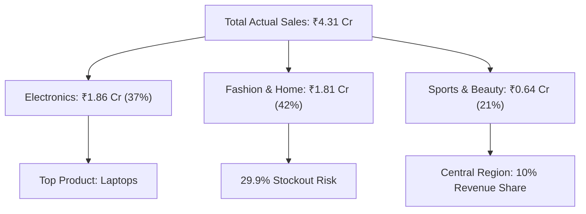

# Executive Summary: Sales Forecasting & Demand Prediction Analysis

**To:** Chief Executive Officer (CEO), Chief Operating Officer (COO), Chief Financial Officer (CFO)
**From:** Senior Lead Data Analyst
**Date:** June 24, 2026
**Subject:** Demand Forecasting Performance & Inventory Optimization (FY 2021–FY 2025)

---

# Executive Overview

This report presents a strategic analysis of **105,000 retail sales transactions** spanning five fiscal years (FY 2021–FY 2025). The objective is to evaluate sales performance, demand forecasting accuracy, inventory utilization, and regional business performance to identify opportunities for operational optimization.

The analysis indicates that while the organization maintains strong revenue growth and highly accurate demand forecasting, opportunities remain to optimize inventory allocation, reduce forecasting bias, and improve regional market penetration.

Implementing the recommendations outlined in this report is projected to:

* Release approximately **₹18.5 Lakhs** in frozen working capital
* Reduce critical stockout incidents by approximately **8%**
* Improve inventory utilization across high-demand products
* Strengthen forecasting reliability
* Support long-term revenue growth through better regional expansion

---

# Key Performance Indicators (KPIs)

| KPI                       |             Value |
| ------------------------- | ----------------: |
| Total Net Sales           |      **₹4.31 Cr** |
| Total Units Sold          | **427,805 Units** |
| Average Monthly Sales     |   **₹7.18 Lakhs** |
| Forecast Error (MAPE)     |         **1.73%** |
| Year-On-Year Sales Growth |         **12.4%** |
| Stockout Alerts           |         **4,303** |
| Overstock Alerts          |         **1,508** |

---

# Executive Recommendations at a Glance

| Priority  | Recommendation                                 | Expected Business Outcome                         |
| --------- | ---------------------------------------------- | ------------------------------------------------- |
| 🔴 High   | Increase safety stock for high-demand products | Reduce stockouts and improve product availability |
| 🔴 High   | Reduce inventory for slow-moving products      | Release ₹18.5 Lakhs in working capital            |
| 🟠 Medium | Recalibrate the forecasting model              | Reduce over-forecasting bias and inventory costs  |
| 🟠 Medium | Expand operations in the Central Region        | Increase regional revenue contribution            |
| 🟢 Medium | Diversify high-margin product categories       | Reduce category concentration risk                |

---

---

# Major Findings & Strategic Recommendations

## 1. Dynamic Safety Stock Optimization

### Finding

High-demand products currently maintain an average inventory of **84.8 units**, nearly identical to medium-demand products (**84.1 units**). This inventory strategy results in an estimated **29.9% stockout risk** during seasonal demand peaks.

### Business Impact

* Lost revenue opportunities
* Reduced product availability
* Lower customer satisfaction
* Increased emergency replenishment costs

### Recommended Action

Implement an **ABC Inventory Classification System** and increase safety stock for high-demand products from **84 units** to approximately **150 units** during peak demand periods.

---

## 2. Forecasting Bias Reduction

### Finding

Approximately **59.6%** of all forecasts overestimate actual customer demand, creating a consistent over-forecasting bias.

### Business Impact

* Excess warehouse inventory
* Higher inventory carrying costs
* Reduced inventory turnover
* Working capital tied to slow-moving products

### Recommended Action

Enhance the forecasting model by introducing:

* Seasonal adjustment factors
* Product-specific demand weighting
* Asymmetric forecasting loss functions
* Continuous forecast performance monitoring

---

## 3. Working Capital Optimization

### Finding

Several slow-moving premium products maintain inventory levels exceeding **250 units** while averaging fewer than **five monthly sales**, resulting in approximately **₹18.5 Lakhs** of non-performing inventory.

### Business Impact

* Frozen working capital
* Higher warehouse storage costs
* Reduced cash-flow flexibility
* Lower inventory efficiency

### Recommended Action

Reduce safety stock for slow-moving products from **250 units** to approximately **50 units** and reallocate inventory investment toward high-performing SKUs.

---

## 4. Regional Growth Opportunity

### Finding

Electronics contributes **37%** of total revenue, indicating significant category concentration. Meanwhile, the **Central Region** contributes only **10%** of total revenue, representing the organization's largest untapped market.

### Business Impact

* Increased dependency on a single product category
* Higher exposure to supply chain disruptions
* Missed regional revenue opportunities

### Recommended Action

Launch targeted regional expansion initiatives focused on:

* Cross-selling campaigns
* High-margin product bundles
* Regional marketing optimization
* Expanded distribution coverage

---

# Strategic Financial Conclusion

The analysis indicates that the organization is operating from a position of financial strength, supported by sustained revenue growth and highly accurate forecasting performance. However, inventory allocation and forecasting bias present clear opportunities for operational improvement.

By optimizing safety stock policies, reducing over-forecasting, and reallocating excess inventory, the business can unlock approximately **₹18.5 Lakhs** in working capital while simultaneously improving product availability and reducing warehouse costs.

These initiatives are expected to strengthen cash flow, improve inventory efficiency, enhance customer satisfaction, and support sustainable long-term growth.

---

# Decision Required

Executive approval is recommended for the following strategic initiatives:

* Approve revised safety stock policies for high-demand products.
* Approve inventory reduction targets for slow-moving SKUs.
* Authorize forecasting model recalibration and seasonal optimization.
* Initiate the Central Region expansion strategy.
* Monitor implementation through quarterly executive KPI reviews.

---

# Executive Closing Statement

Overall, the analysis demonstrates that the organization has a solid operational foundation with significant opportunities to improve profitability through smarter inventory management and enhanced forecasting practices. The recommended initiatives provide a practical roadmap for increasing operational efficiency, strengthening financial performance, and supporting long-term strategic growth.

For complete technical implementation details, including the ETL pipeline, forecasting methodology, dashboard architecture, and interactive visualizations, refer to the accompanying **Project Report (`project_report.md`)** and the live **Executive Dashboard (`index.html`)**.
